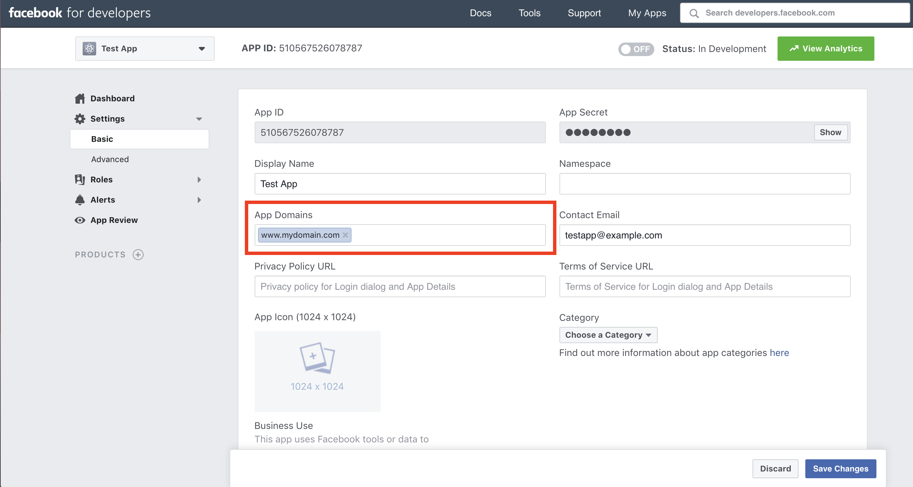

The advanced starters have built-in add-ons such as Google Analytics and Facebook Comments that can be taken advantage of with the use of environment variables.

## Setting up Environment Variables
If you want to configure environment variables for a certain environment, you should have a `.env.<environment>` file (e.g. `.env.production`) within your repository. Note that you might need to remove this file from your `.gitignore` file for this to work properly. If you're checking in a `.env.<environment>` file to a public repository, be sure to **verify that you don't have any secret keys in there.**

In your `gatsby-config.js` file, you will probably have the following:

```
# gatsby-config.js

require('dotenv').config();
```

To configure environment variables for your environments, change this to the following:

```
# gatsby-config.js

require('dotenv').config({
  path: `.env.${process.env.NODE_ENV}`,
});
```

Once this is in place, you will be able to utilize the environment variables in your dotenv file.

```
# Example .env.production file

THIRD_PARTY_APP_ID="1234"
```

For a full overview of setting up environment variables, check out the [Gatsby documentation](https://www.gatsbyjs.org/docs/environment-variables/).

## Setting up Google Analytics
To setup Google Analytics you'll need a Google Tracking ID. If you don't already have a tracking ID, visit https://analytics.google.com/ to create one.

Once you have your Google Tracking ID, you can add the following to your dotenv file (recommended):

```
# Example .env.production file

GOOGLE_ANALYTICS_ID="UA-12345678-9"
```

Or you can hardcode it into your `gatsby-config.js` file like so:

```
...

  {
    resolve: `gatsby-plugin-google-analytics`,
    options: {
      trackingId: "UA-12345678-9",
  },

...
```

## Setting up Facebook Comments
To setup Facebook Comments on your posts, you will need a Facebook App ID. If you don't already have a Facebook App, visit https://developers.facebook.com/ to create one.

Once you have your Facebook App ID, you can add the following to your dotenv file:

```
# Example .env.production file

GATSBY_FACEBOOK_APPID="123456789"
```

Be sure to add the domains that you want to allow your Facebook Comments to appear on under App Domains in the Basic Settings section.


